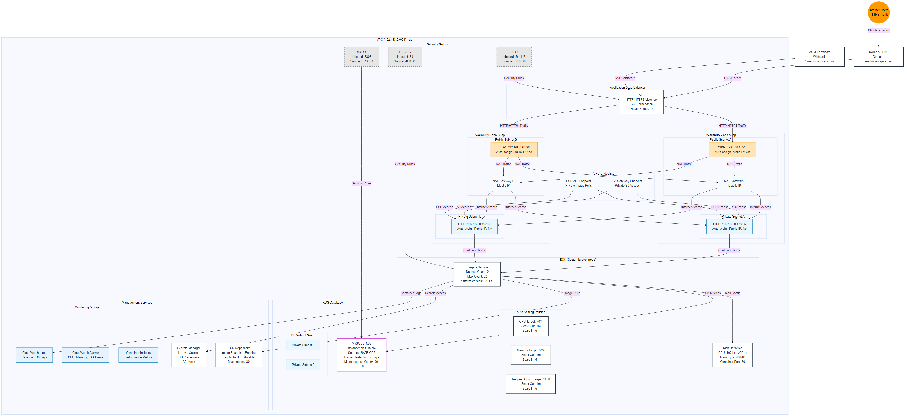

# AWS Infrastructure Documentation

This repository contains Terraform configuration files for deploying a containerized application on AWS using ECS Fargate with Aurora MySQL as the database backend.

## Architecture Overview

This infrastructure implements a modern, scalable, and highly available architecture with the following components:

- VPC with public and private subnets across two availability zones
- ECS Fargate for container orchestration
- Aurora MySQL Serverless v2 for database
- Application Load Balancer for traffic distribution
- ACM for SSL/TLS certificate management
- Route 53 for DNS management
- ECR for container image storage
- Auto-scaling based on CPU, memory, and request count
- Automated deployment pipeline via EventBridge and Lambda



## Infrastructure Components

### Networking (vpc.tf)

- **VPC**: Class C IP address space (192.168.0.0/24)
- **Subnets**: 
  - 2 public subnets for ALB (192.168.0.0/26, 192.168.0.64/26)
  - 2 private subnets for ECS tasks and database (192.168.0.128/26, 192.168.0.192/26)
- **NAT Gateways**: One per AZ for outbound internet access from private subnets
- **Internet Gateway**: For public subnet internet access
- **S3 VPC Endpoint**: For secure access to S3 without traversing the internet

Documentation: [AWS VPC](https://docs.aws.amazon.com/vpc/latest/userguide/what-is-amazon-vpc.html)

### Container Registry (ecr.tf)

- Amazon ECR repository for storing container images
- Image scanning on push for security vulnerability detection
- Lifecycle policy to limit repository to the latest 3 images

Documentation: [Amazon ECR](https://docs.aws.amazon.com/AmazonECR/latest/userguide/what-is-ecr.html)

### Container Orchestration (cluster.tf, task-definition.tf, ecs-fargate-service.tf)

- ECS cluster with FARGATE and FARGATE_SPOT capacity providers
- Task definition with resource allocation (256 CPU units, 512MB memory)
- Service configuration with capacity provider strategy
- Auto-scaling policies based on:
  - CPU utilization (70%)
  - Memory utilization (80%)
  - Request count per target (1000)

Documentation: 
- [Amazon ECS](https://docs.aws.amazon.com/AmazonECS/latest/developerguide/Welcome.html)
- [AWS Fargate](https://docs.aws.amazon.com/AmazonECS/latest/developerguide/AWS_Fargate.html)

### Load Balancing (alb.tf)

- Application Load Balancer for traffic distribution
- Target group with health checks at `/api/health`
- HTTP to HTTPS redirect
- Sticky sessions for maintaining user state

Documentation: [Elastic Load Balancing](https://docs.aws.amazon.com/elasticloadbalancing/latest/application/introduction.html)

### Database (aurora-mysql.tf)

- Aurora MySQL Serverless v2 cluster
- Multi-AZ deployment with 2 instances
- Autoscaling from 0.5 to 4 ACUs (Aurora Capacity Units)
- 7-day backup retention

Documentation: [Amazon Aurora](https://docs.aws.amazon.com/AmazonRDS/latest/AuroraUserGuide/CHAP_AuroraOverview.html)

### Security (security-group.tf, iam.tf)

- Security groups with least privilege access:
  - ALB: Accept HTTP/HTTPS from internet
  - Fargate: Accept traffic only from ALB
  - Database: Accept traffic only from Fargate tasks
- IAM roles for:
  - ECS task execution
  - ECS task (application permissions)
  - Lambda execution

Documentation:
- [Security Groups](https://docs.aws.amazon.com/vpc/latest/userguide/VPC_SecurityGroups.html)
- [IAM](https://docs.aws.amazon.com/IAM/latest/UserGuide/introduction.html)

### SSL/TLS and DNS (acm.tf, route53-dns-record.tf)

- ACM certificate for domain with DNS validation
- Route 53 A record for `server.example.com` pointing to ALB
- Optional wildcard certificate for subdomains

Documentation:
- [AWS Certificate Manager](https://docs.aws.amazon.com/acm/latest/userguide/acm-overview.html)
- [Amazon Route 53](https://docs.aws.amazon.com/Route53/latest/DeveloperGuide/Welcome.html)

### Monitoring and Logging (cloudwatch.tf)

- CloudWatch Log Groups for ECS services with 30-day retention
- Container Insights enabled for enhanced monitoring

Documentation: [Amazon CloudWatch](https://docs.aws.amazon.com/AmazonCloudWatch/latest/monitoring/WhatIsCloudWatch.html)

### Continuous Deployment (ecs-update-service.tf)

- EventBridge rule to monitor ECR image pushes with tag "jellybean"
- Lambda function to trigger ECS service updates automatically
- Python-based Lambda function with proper IAM permissions

Documentation:
- [Amazon EventBridge](https://docs.aws.amazon.com/eventbridge/latest/userguide/eb-what-is.html)
- [AWS Lambda](https://docs.aws.amazon.com/lambda/latest/dg/welcome.html)

## Configuration Variables

Key configuration variables can be customized in `terraform.tfvars` and `variables.tf`:

- `project_name`: Base name for resources (default: "CloudStruct")
- `environment`: Environment name (default: "production")
- `domain_name`: Primary domain name (default: "artisantiling.co.nz")
- `db_name`, `db_username`, `db_password`: Database credentials

## Deployment

### Prerequisites

- AWS CLI configured with appropriate permissions
- Terraform 1.0.0+
- Docker (for building container images)
- A registered domain in Route 53
- GitHub repository with GitHub Actions configured

### Deployment Steps

1. Clone this repository
2. Configure the following GitHub Actions secrets:
   - `AWS_ACCESS_KEY_ID`: Your AWS access key
   - `AWS_SECRET_ACCESS_KEY`: Your AWS secret key
   - `AWS_REGION`: Your AWS region (e.g., ap-southeast-2)
   - `DB_SERVER`: Database server endpoint (Aurora endpoint)
   - `DB_NAME`: Database name
   - `DB_USER`: Database username
   - `DB_PASSWORD`: Database password
   - `ECR_REPOSITORY`: ECR repository name
3. Update other configuration parameters in `terraform.tfvars` as needed
4. Push changes to the main branch to trigger the GitHub Actions workflow

### CI/CD Workflow

This project includes a GitHub Actions workflow for continuous integration and deployment. The workflow file (`.github/workflows/build-deploy.yml`) automatically:

1. Builds the application container image
2. Creates an `appsettings.json` with database connection strings using GitHub secrets 
3. Pushes the image to Amazon ECR with the tag "jellybean"
4. Triggers automatic deployment via the EventBridge and Lambda function

```yaml
name: Build and Deploy to AWS ECR

on:
  push:
    branches: [ main ]
  pull_request:
    branches: [ main ]
  workflow_dispatch:

jobs:
  build-and-deploy:
    runs-on: ubuntu-latest
    
    steps:
    - name: Checkout code
      uses: actions/checkout@v3
      
    - name: Configure AWS credentials
      uses: aws-actions/configure-aws-credentials@v2
      with:
        aws-access-key-id: ${{ secrets.AWS_ACCESS_KEY_ID }}
        aws-secret-access-key: ${{ secrets.AWS_SECRET_ACCESS_KEY }}
        aws-region: ${{ secrets.AWS_REGION }}
      
    - name: Login to Amazon ECR
      id: login-ecr
      uses: aws-actions/amazon-ecr-login@v1
      
    - name: Create appsettings.json
      run: |
        cat > appsettings.json << EOF
        {
          "ConnectionStrings": {
            "DefaultConnection": "Server=${{ secrets.DB_SERVER }};Database=${{ secrets.DB_NAME }};User=${{ secrets.DB_USER }};Password=${{ secrets.DB_PASSWORD }};"
          },
          "Logging": {
            "LogLevel": {
              "Default": "Information",
              "Microsoft.AspNetCore": "Warning"
            }
          },
          "AllowedHosts": "*"
        }
        EOF
        
    - name: Build and push image to AWS ECR
      env:
        ECR_REGISTRY: ${{ steps.login-ecr.outputs.registry }}
        ECR_REPOSITORY: ${{ secrets.ECR_REPOSITORY }}
      run: |
        docker build -t $ECR_REGISTRY/$ECR_REPOSITORY:jellybean .
        docker push $ECR_REGISTRY/$ECR_REPOSITORY:jellybean
```

After deployment, monitor the ECS service in the AWS Console.

## Security Considerations

- Database credentials are securely stored as GitHub Actions secrets and injected during deployment
- Consider enabling deletion protection in production
- Database has `skip_final_snapshot` set to true, which should be changed in production
- For additional security, consider using AWS Secrets Manager for runtime credential access

## Outputs

The following outputs are available after deployment:

- `repository_url`: ECR repository URL
- `task_definition_arn`: ECS task definition ARN
- `cluster_arn`: ECS cluster ARN
- `cluster_name`: ECS cluster name
- `certificate_arn`: ACM certificate ARN
- `zone_id`: Route 53 zone ID
- `server_dns`: DNS name for the server subdomain
- `rds_endpoint`: Aurora database endpoint
- `rds_reader_endpoint`: Aurora database reader endpoint
- `rds_port`: Aurora database port

## Maintenance and Operations

### Scaling

The infrastructure automatically scales based on:
- CPU utilization (target: 70%)
- Memory utilization (target: 80%)
- Request count per target (target: 1000)

You can adjust these values in `variables.tf`.

### Monitoring

Monitor your application using:
- CloudWatch Container Insights
- CloudWatch Logs
- ALB access logs

### Updating the Application

The application updates automatically through the CI/CD pipeline:

1. Make changes to your application code
2. Commit and push to the main branch
3. GitHub Actions will build a new container image with the "jellybean" tag
4. The image is pushed to ECR, triggering the EventBridge rule
5. The Lambda function detects the new image and updates the ECS service
6. The ECS service performs a rolling deployment of the new version

You can also manually trigger the workflow using GitHub Actions' workflow_dispatch event.

## Cost Optimization

- Fargate Spot is configured for cost savings (75% of capacity)
- Aurora Serverless v2 scales down to 0.5 ACUs when not in use
- Consider scheduling scaling for predictable workloads

## License

[Specify your license here]

## Contributors

[List contributors here]